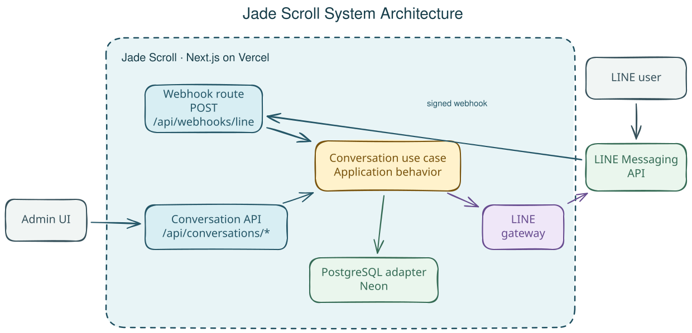
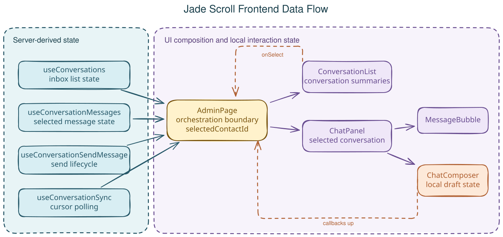

# Jade Scroll

## Overview

Jade Scroll is a LINE Official Account chat console built with Next.js,
TypeScript, PostgreSQL, and the LINE Messaging API.

It receives text messages from a LINE OA, groups them by contact, displays
conversation history, and lets an operator reply from a protected admin
console.

The product is intentionally small. The interesting part is how the system
keeps a simple request/response architecture while still giving the operator
an incremental, conversation-like experience.

## System Architecture



The system has two entry points:

- LINE calls the public webhook with a signed event payload.
- The admin browser calls protected conversation APIs.

Both paths converge on the conversation use case. The use case owns the
application behavior; PostgreSQL and LINE are behind outbound ports and
adapters.

The boundaries are deliberately lightweight:

- Next.js Route Handlers translate HTTP into application calls.
- The conversation use case coordinates behavior without knowing HTTP or SQL.
- The PostgreSQL adapter owns persistence and transaction details.
- The LINE adapter owns signature verification, profile lookup, and message
  delivery.

There is no framework built around the framework and no extra service layer
whose only purpose is to make the folder tree look architectural.

## Engineering the Synchronization Flow

This is the central design decision in Jade Scroll.

### 1. Next.js on Vercel

The application is built as a Next.js app and deployed on Vercel. Route
handlers are a good fit for webhook delivery and short API requests, but the
application should not assume that one server process will remain alive for a
browser session.

### 2. Why not WebSocket

WebSocket was the first option I considered because chat naturally benefits
from realtime delivery.

However, Jade Scroll is deployed as a Next.js application on Vercel. The
serverless request/response model is not a good fit for keeping
application-owned WebSocket connections alive.

Supporting WebSocket would therefore mean introducing additional realtime
infrastructure or another stateful runtime.

For the current scope, I chose polling instead.

### 3. Why polling

Polling fits the deployment model without introducing another service.

The admin console checks for new messages approximately every two seconds.
But polling the entire conversation history repeatedly would waste database
work, so the next problem became how to fetch only messages the browser had
not seen yet.

That led to the cursor design.

The synchronization flow is therefore:

```text
Next.js + Vercel
      ↓
no dedicated long-lived WebSocket runtime
      ↓
polling is sufficient for the current requirement
      ↓
avoid refetching full history every ~2 seconds
      ↓
incremental cursor
      ↓
messages.id as the cursor
      ↓
GET /api/conversations/sync?cursor=n
      ↓
WHERE id > n ORDER BY id ASC
      ↓
PostgreSQL is polled directly
```

The client starts from the latest message already known by the inbox and
advances its cursor when new messages arrive. The polling hook uses recursive
`setTimeout`, so the next request is scheduled only after the current request
finishes:

```text
sync
  ↓
finish
  ↓
wait
  ↓
sync again
```

This prevents a slow request from creating overlapping synchronization calls.

### 4. Why `messages.id` becomes the cursor

`messages.id` is a PostgreSQL `BIGINT GENERATED ALWAYS AS IDENTITY` primary
key. For the current low-concurrency workload, it provides:

- a compact numeric cursor;
- a natural ordering key for message history;
- a primary-key B-tree that supports `id > cursor ORDER BY id`.

The synchronization query is intentionally small:

```sql
SELECT ...
FROM messages
WHERE id > $cursor
ORDER BY id ASC;
```

This is an incremental boundary, not a claim that the database is a durable
event log.

### 5. What the cursor guarantees and does not guarantee

The cursor guarantees that a normal sync request asks for messages whose
identity is greater than the last cursor observed by the client. It avoids
reloading already-seen history and lets the API return a stable `nextCursor`.

It does not guarantee:

- gap-free identity values;
- ordering by transaction commit time;
- a globally durable event-log position;
- strict visibility ordering under highly concurrent writers.

PostgreSQL identity values are allocation-ordered, not commit-ordered event
offsets. The cursor is therefore intentionally scoped to the current
low-concurrency workload rather than treated as a durable event-log position.

If strict stream ordering becomes necessary, the cursor can move to a
transactional outbox or commit-ordered change feed while preserving the same
frontend cursor contract.

### Why PostgreSQL is polled directly

PostgreSQL is currently both the source of truth and the source read by the
sync endpoint. I intentionally kept that path direct because the current
traffic does not justify another stateful infrastructure component.

The trade-off is clear: empty sync requests still reach PostgreSQL.

If repeated polling becomes a measurable database cost, Redis could be added as
a lightweight cache in front of PostgreSQL. Even a simple latest-cursor cache
with invalidation when new messages arrive could absorb many empty polls.

PostgreSQL would still remain the source of truth.

## Reliability at the Boundaries

### Webhook idempotency

LINE can retry webhook deliveries. The webhook therefore verifies the
`X-Line-Signature` before parsing the event, and inbound persistence uses the
LINE message ID as a deduplication key.

The database protects the identity with a partial unique index on
`(contact_id, line_message_id)`. A retried delivery becomes harmless instead
of creating duplicate conversation history.

### Transactional inbound persistence

Recording an inbound message changes several related pieces of state:

1. upsert the contact;
2. insert the message, ignoring a duplicate provider message ID;
3. advance the contact's `last_message_id` projection.

Those operations belong to one repository operation and one database
transaction. The use case asks to record an inbound message; it does not
orchestrate individual table writes.

### Outbound delivery trade-off

The current outbound flow sends the reply through LINE and then persists the
final local message state. This keeps the implementation small and makes the
operator see the provider result, but it has a known failure window: LINE may
accept the message while the following database write fails.

If outbound delivery guarantees become more important, the natural next step
is a transactional outbox and a background delivery worker. The limitation is
explicit rather than hidden behind an abstraction that cannot guarantee it.

### Lightweight admin session

The public deployment can send real LINE messages, so the operator APIs are
protected. The access flow is intentionally small:

```text
/r/[token]
    ↓
verify admin access token
    ↓
issue signed HttpOnly session cookie
    ↓
/admin
```

The session is an HMAC-signed value with an expiry and nonce. It lasts for 14
days and uses `HttpOnly`, `Secure` in production, and `SameSite=Lax`.

There is no user table, JWT claims model, refresh-token flow, OAuth provider,
or role system because this project currently has one operator boundary rather
than a user-management problem.

## Frontend Data Flow



`AdminPage` is the frontend orchestration boundary. It composes focused hooks
instead of introducing a global store:

- `useConversations` owns the inbox list;
- `useConversationMessages` owns the selected conversation history;
- `useConversationSendMessage` owns the send lifecycle;
- `useConversationSync` owns background synchronization and the cursor.

The component tree follows the ownership boundary:

```text
hooks → AdminPage → ConversationList / ChatPanel
                         ↓              ↓
                ConversationItem   MessageBubble
                                        ↑
                                  ChatComposer
```

Server-derived state lives in the focused hooks. The draft inside
`ChatComposer` is ephemeral local state because no other component needs to
own it. State moves down through props and user intent moves up through
callbacks.

Incoming messages are merged into message state and the inbox projection. A
conversation summary is refreshed only when the new message cannot be applied
to the existing summary, avoiding one refetch per message during a sync batch.

## Data Model

The persistence model has two tables:

```text
contacts
  id                 BIGINT identity primary key
  line_user_id       TEXT unique
  display_name       TEXT nullable
  picture_url        TEXT nullable
  last_message_id    BIGINT nullable

messages
  id                 BIGINT identity primary key
  contact_id         BIGINT → contacts.id
  line_message_id    TEXT nullable
  direction          inbound | outbound
  type               text
  content            TEXT
  status             received | sent | failed
```

Three fields carry most of the design:

- `messages.id` is the incremental synchronization cursor;
- `contacts.last_message_id` is a denormalized projection for inbox ordering;
- the unique LINE message identity makes webhook processing idempotent.

The exact DDL, indexes, and constraints are in
[`migrations/init.sql`](migrations/init.sql).

## Project Structure

```text
src/
├── app/             Next.js pages and Route Handlers
├── application/     conversation use case
├── conversation/    domain types and outbound ports
├── adapter/
│   ├── line/        LINE signature, webhook, and gateway adapters
│   └── postgres/    database client and repository adapter
├── auth/            admin token and signed session primitives
├── hooks/           frontend state and synchronization
├── lib/             browser API and pure state helpers
└── config/          validated server configuration

migrations/
└── init.sql
```

## API

| Method | Route | Purpose | Access |
| --- | --- | --- | --- |
| `GET` | `/api/healthz` | Process health check | Public |
| `GET` | `/api/readyz` | Database readiness check | Public |
| `POST` | `/api/webhooks/line` | Receive signed LINE events | LINE signature |
| `GET` | `/api/conversations` | Load the inbox | Admin session |
| `GET` | `/api/conversations/sync?cursor=...` | Fetch messages after a cursor | Admin session |
| `GET` | `/api/conversations/:contactId/messages` | Load conversation history | Admin session |
| `POST` | `/api/conversations/:contactId/messages` | Send a LINE reply | Admin session |

## Environment Variables

The server validates its environment at startup with Zod. Configure these
variables in the local environment or deployment provider:

| Variable | Purpose |
| --- | --- |
| `DATABASE_URL` | PostgreSQL connection string |
| `LINE_OA_NAME` | Display name for the LINE Official Account |
| `LINE_CHANNEL_SECRET` | Verifies incoming LINE webhook signatures |
| `LINE_CHANNEL_ACCESS_TOKEN` | Sends requests to the LINE Messaging API |
| `ADMIN_ACCESS_TOKEN` | Bootstrap token for `/r/[token]`; at least 22 characters |
| `SESSION_SECRET` | Signs admin session cookies; at least 43 characters |

Secret values belong in the deployment environment, not in the repository.

## Testing

The tests focus on boundaries where behavior matters:

- conversation use-case behavior with repository and gateway doubles;
- conversation API contracts;
- incremental synchronization behavior;
- LINE webhook signature and event handling;
- admin access token to session exchange.

```bash
npm test
```

The unit tests do not require live LINE or PostgreSQL infrastructure.

## Where I Would Take It Next

The evolution path follows pressure rather than adding infrastructure in
advance.

### Current

```text
PostgreSQL polling
```

### If database polling becomes expensive

The current sync endpoint reads PostgreSQL directly. At the current scale,
that keeps the system simple.

Redis could sit in front of the synchronization path as a lightweight cache.
Even a simple latest-cursor cache with invalidation when messages change could
absorb many empty polls while PostgreSQL remains the source of truth.

### If the same operator opens multiple tabs

Today every tab owns its own polling loop:

```text
Tab A ─┐
Tab B ─┼─ poll backend
Tab C ─┘
```

Before changing the server transport entirely, another useful optimization
would be to coordinate tabs in the same browser. Web Locks can elect a polling
leader, while BroadcastChannel distributes updates to sibling tabs:

```text
Tab A = leader
   │
   ├── poll backend
   │
   └── BroadcastChannel
         ├── Tab B
         └── Tab C
```

This reduces multi-tab amplification without changing the API contract or
requiring new backend infrastructure.

### If the polling model itself no longer scales

```text
Pressure: polling model no longer scales
        ↓
transactional outbox / change stream
        ↓
Redis, broker, or managed realtime service
        ↓
SSE or WebSocket transport
```

That is the natural point to introduce a realtime transport: when observed
load justifies it, not as a default dependency for the first version.
